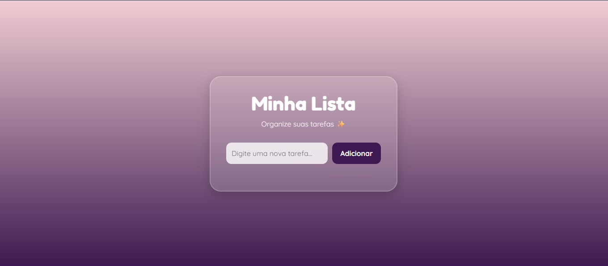

# 🦥 To Do List

Um sistema de lista de tarefas desenvolvido com **HTML, CSS e JavaScript**, contendo múltiplas páginas como login, cadastro e tela principal.

---

## 🚀 Funcionalidades

- Sistema de login (interface)
- Tela de cadastro de usuário
- Página inicial do sistema
- Adição e gerenciamento de tarefas
- Interface simples e organizada

---

## 🖥️ Interface do projeto




---

## 📁 Estrutura do projeto

```bash
📦 to-do-list
┣ 📂 public
┃ ┣ 📜 cadastro.html
┃ ┣ 📜 cadastro.css
┃ ┣ 📜 home.html
┃ ┣ 📜 home.css
┃ ┣ 📜 inicial.html
┃ ┣ 📜 inicial.css
┃ ┣ 📜 login.html
┃ ┣ 📜 login.css
┃ ┗ 🖼️ Preguiça.png
┣ 📜 script.js
┣ 📜 LICENSE
┗ 📜 README.md
```


---

## 🚀 Como executar o projeto

```bash
git clone https://github.com/mariafsd012/ToDoList-.git

